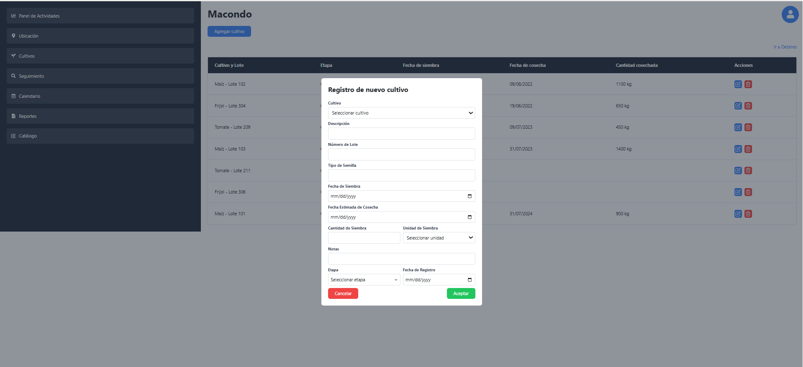
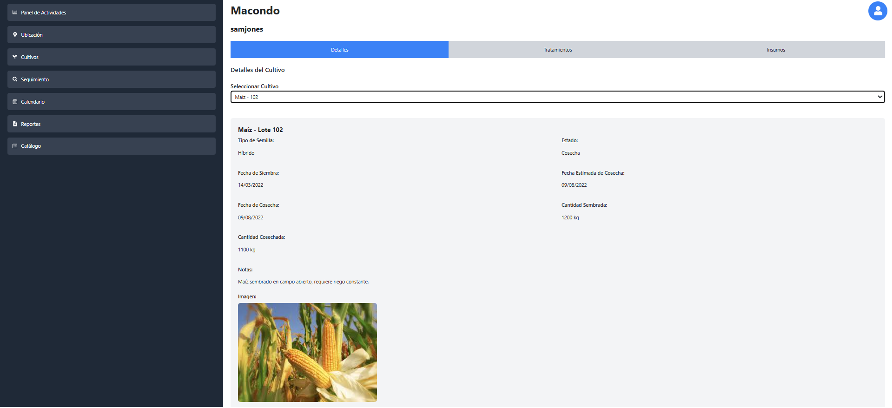
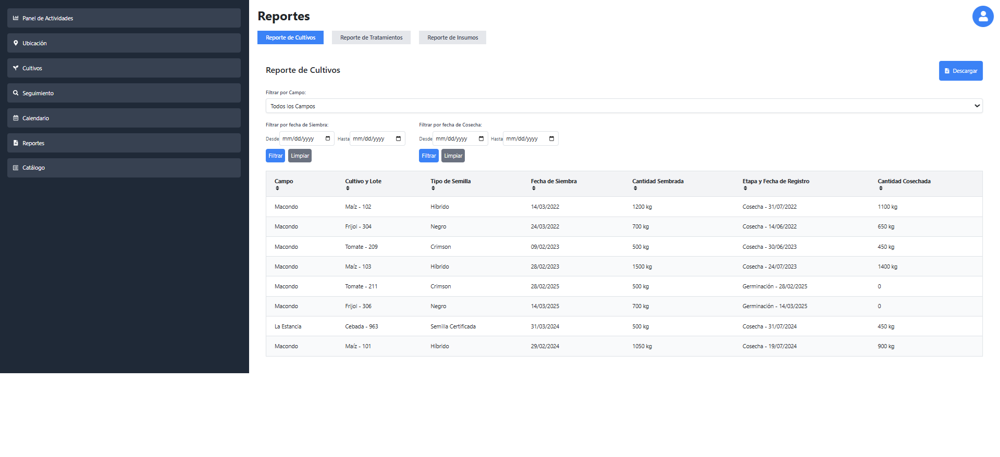
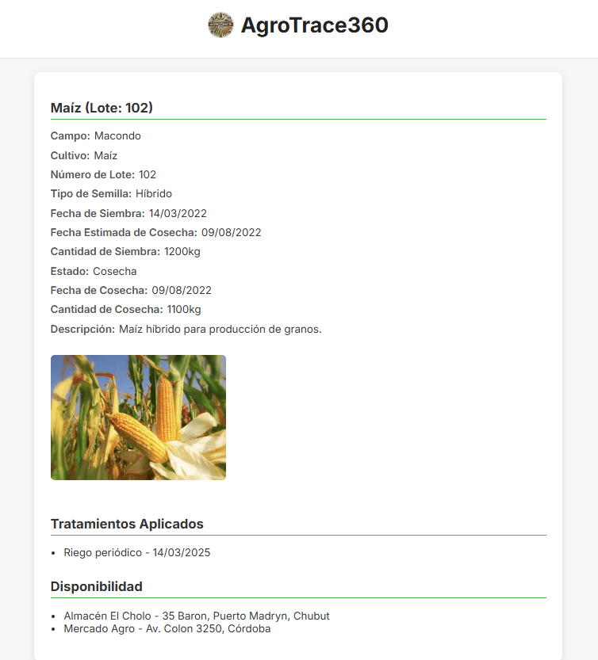

# 🌾 AgroTrace 360

**AgroTrace 360** is a web-based platform designed to help small and medium-sized agricultural producers in Argentina manage their crops, treatments, and traceability data. It allows producers to register fields, track crop lifecycles, generate QR codes for consumer transparency, and view dashboards and reports.

🔗 **Live Demo**: [http://agrotrace360.s3-website-us-east-1.amazonaws.com](http://agrotrace360.s3-website-us-east-1.amazonaws.com)

---

## 🚀 Features

- ✅ User registration and login
- 🌍 Field geolocation via Google Maps
- 🌱 Crop registration, editing, and harvest tracking
- 💧 Treatment and input management
- 📊 Interactive dashboard and calendar
- 📄 CSV exportable reports
- 📦 QR code generation for each harvested crop
- 🌐 Public crop detail pages for consumers

---

## 🖼️ Screenshots

### Dashboard


### Crop Registration


### Tracking


### Reports


### QR Code and Public View


---

## ⚙️ Tech Stack

- **Frontend**: React + TypeScript, Tailwind CSS, Recharts, Google Maps API
- **Backend**: Node.js (AWS Lambda)
- **Database**: MySQL (Amazon RDS)
- **Hosting**: AWS S3, API Gateway, Lambda
- **Testing**: Cypress (Component & E2E)

---

## 📦 How to Run Locally

> _Instructions if you want to include local dev setup_

```bash
# Clone the repo
git clone https://github.com/atamagnini/agrotrace360.git
cd agrotrace360

# Install dependencies
npm install

# Start the dev server
npm run dev
